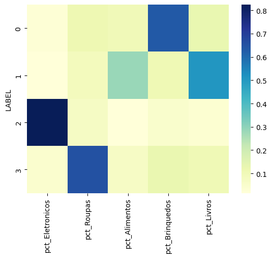

# 📊 Projeto de Clusterização de Clientes

Este projeto tem como objetivo **entender o comportamento de compra dos clientes** a partir dos dados de vendas dos últimos 6 meses, utilizando **modelo de Machine Learning (K-Means)** para realizar a **segmentação de clientes**.  

A segmentação é um passo estratégico para permitir que o time de **marketing e vendas** desenvolva campanhas mais direcionadas e eficientes, de acordo com o perfil de cada cluster.

---

## 🚀 Objetivos
- Extrair e analisar dados de vendas de clientes dos últimos 6 meses.
- Identificar padrões de comportamento de compra.
- Realizar a clusterização de clientes em diferentes dimensões (categorias de produtos e RFV).
- Definir o número ótimo de clusters de forma estatística.
- Consolidar os clusters em um único perfil final.
- Disponibilizar os resultados em um banco de dados para consumo por outras áreas.
- Garantir reprodutibilidade e rastreabilidade do experimento via **MLflow**.

---

## 🛠️ Tecnologias Utilizadas

- **Linguagem**: Python, SQL
- **Bibliotecas principais**:
  - `pandas`, `scikit-learn`, `matplotlib`, `seaborn`
  - `sqlalchemy` (integração com banco de dados)
  - `mlflow` (rastreabilidade e versionamento dos experimentos)
- **Modelagem**: K-means
- **Extras**: Git

---

## 🛠️ Metodologia

A abordagem utilizada foi realizada em **duas etapas de clusterização**:

### 1️⃣ Etapa 1 – Segmentação por Categoria de Produtos
- **Features utilizadas**: % de compras de cada cliente em relação a cada categoria de produto.
- **Clusters identificados**:
  - `Brinquedos_Lovers`
  - `Livros&Food`
  - `Tech_Lovers`
  - `Moda_Lovers`

### 2️⃣ Etapa 2 – Segmentação por Critérios RFV
- **RFV = Recência, Frequência, Valor**
- Features utilizadas:
  - **Recência**: tempo desde a última compra
  - **Frequência**: quantidade de compras realizadas
  - **Valor**: gasto total no período
- **Clusters identificados**:
  - `01-Frequentes de Baixo Valor`
  - `02-Frequentes de Medio Valor`
  - `03-VIPs/Alta Receita`
  - `04-Risco churn`

### 📐 Definição do Número de Clusters
- Para cada etapa, foi utilizado o **Silhouette Score** como métrica para determinar o número ótimo de clusters.  
- Esse método mede a **coesão interna e separação entre clusters**, garantindo maior qualidade na segmentação.

### 🔗 Consolidação das Clusterizações
- A junção das duas análises foi realizada unindo os resultados:  
  - Exemplo: Cliente no cluster **"Tech_Lovers"** (Etapa 1) e **"03-VIPs/Alta Receita"** (Etapa 2) foi classificado como **"03-VIPs/Alta Receita:Tech_Lovers"**.  

### 📝 Logging e Reprodutibilidade
- Todos os experimentos de clusterização foram **registrados no MLflow**, incluindo:
  - Parâmetros do modelo (ex.: `n_clusters`)
  - Métricas (ex.: Silhouette Score)
  - Artefatos gerados (ex.: gráficos de Elbow Method, matrizes de cluster)
- Isso garante **rastreabilidade**, **comparação entre runs** e **reprodutibilidade** dos resultados.

---

## 🧩 Pipeline do Projeto

1. **Extração de dados** (SQL)
   - Consulta dos últimos 6 meses de vendas
   - Pré-processamento (limpeza, padronização e agregações necessárias)
   - Escolha das features para treinar o modelo

2. **Clusterização 1 (Categorias de Produtos)**
   - Transformação de compras em proporções (% por categoria)
   - Aplicação do algoritmo **K-Means**
   - Definição do número de clusters via **Silhouette Score**
   - Logging no **MLflow**

3. **Clusterização 2 (RFV)**
   - Cálculo das métricas de Recência, Frequência e Valor
   - Aplicação do algoritmo **K-Means**
   - Definição do número de clusters via **Silhouette Score**
   - Logging no **MLflow**

4. **Combinação dos Resultados**
   - Criação do cluster final unindo as duas dimensões
   - Nomeação final no formato **Cluster_RFQ:Cluster_Categoria**

5. **Armazenamento**
   - Inserção da tabela **Cluster_Clientes** em banco de dados via **SQLAlchemy**

---

## 📊 Exemplos de Resultados Obtidos

- **Cluster Final "03-VIPs/Alta Receita:Tech_Lovers"**  
  Clientes de **alto valor**, com forte **preferência em tecnologia**.  
  *Ação sugerida*: campanhas exclusivas de lançamentos tecnológicos e programas de fidelização VIP.

- **Cluster Final "04-Risco churn:Livros&Food"**  
  Clientes que já gastaram, mas estão **diminuindo engajamento**, com preferência em **livros e alimentação**.  
  *Ação sugerida*: campanhas de recuperação, cupons de desconto e marketing personalizado.

- **Cluster Final "01-Frequentes de Baixo Valor:Moda_Lovers"**  
  Clientes que compram com frequência, mas com **ticket médio baixo**, voltados para **moda**.  
  *Ação sugerida*: estratégias de cross-sell e upsell para aumentar o valor médio.

---

## 📌 Próximos Passos

- Testar outros algoritmos de clusterização (DBSCAN, Gaussian Mixture).
- Monitorar periodicamente os clusters para capturar mudanças de comportamento.
- Criar dashboards (ex.: Power BI, Tableau) conectados à tabela **Cluster_Clientes**.

